# RECIPEDIA


### Recipedia 링크 : https://j12s003.p.ssafy.io/

## 목차

1. [프로젝트 개요](#프로젝트-개요)
2. [기능 소개](#기능-소개)
3. [기술 스택](#기술-스택)
4. [서비스 아키텍처](#서비스-아키텍처)
5. [ERD](#erd)
6. [프로젝트 구조](#프로젝트-구조)
   - [Frontend](#frontend-1)
   - [Backend](#backend-1)
   - [AI](#ai-1)
7. [포팅메뉴얼](#포팅메뉴얼)
8. [팀 소개](#팀-소개)

## 프로젝트 개요

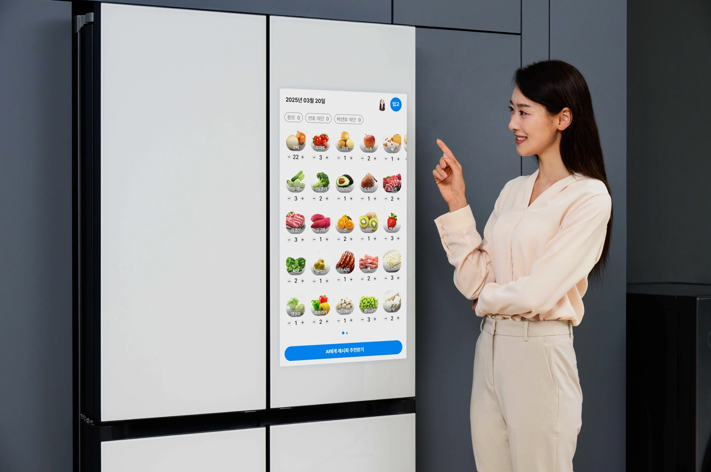

### 📋 **서비스 개요**

- 생성형 AI 기반 레시피 추천 서비스
- 냉장고 재료 및 개인 선호를 반영한 레시피를 제공하는 서비스입니다.
- **기간:** 2025/2/24 ~ 2025/4/11 (7주)

### 💰 **서비스 특징**

1. **재료 입출고**
   - 사용자는 자유롭게 재료를 입출고할 수 있습니다.
2. **레시피 생성**
   - 냉장고 내 재료 및 개인 선호도 (선호/비선호 재료, 식단, 알러지 정보)를 기반으로 LLM을 활용하여 요리 이름을 생성하고,
     유튜브 내 레시피 영상 리스트를 제공합니다.
3. **단계별 레시피 텍스트**
   - 레시피 영상 내 자막 정보를 추출 및 요약하여 단계별 레시피 텍스트를 제공합니다.
   - 타임스탬프, 자동 스크롤 등의 기능을 통해 간편하게 레시피를 확인할 수 있습니다.
   - 타이머, 요리 재료 정보 등 요리에 도움이 되는 기능들을 제공받을 수 있습니다.
4. **즐겨찾기 및 이전 레시피**
   - 마음에 드는 레시피를 저장하고, 과거에 만든 요리를 다시 찾아볼 수 있습니다.

## 기능 소개

### 메인 화면

#### 재료 입출고

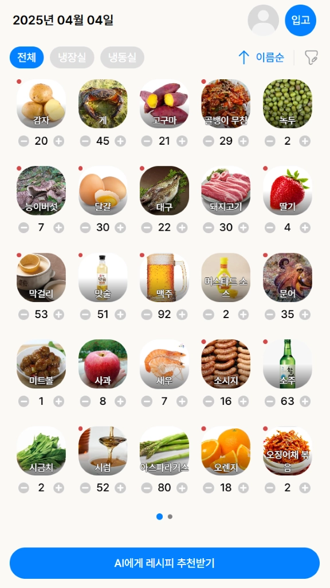
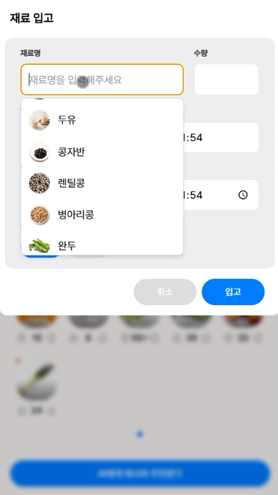
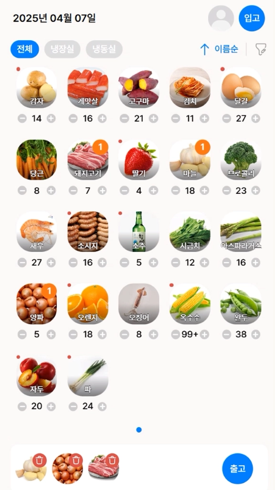


#### 개인 선호 필터링

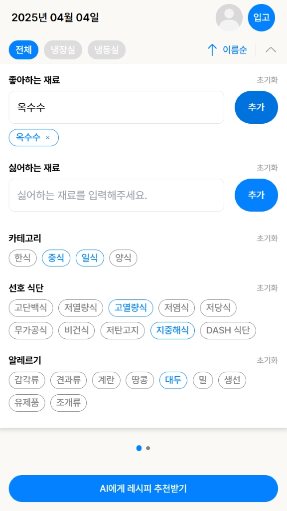

### 레시피 생성


### 레시피 추출

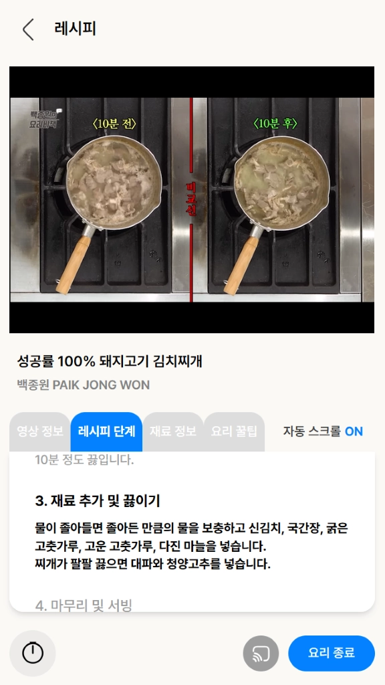

### 사용자 프로필

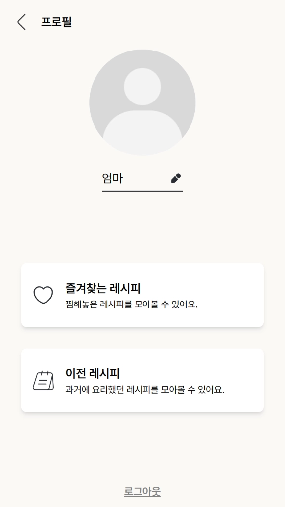


#### 즐겨찾기

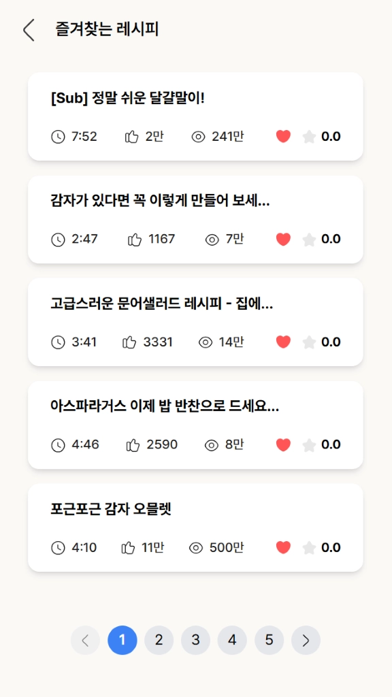

#### 이전 레시피

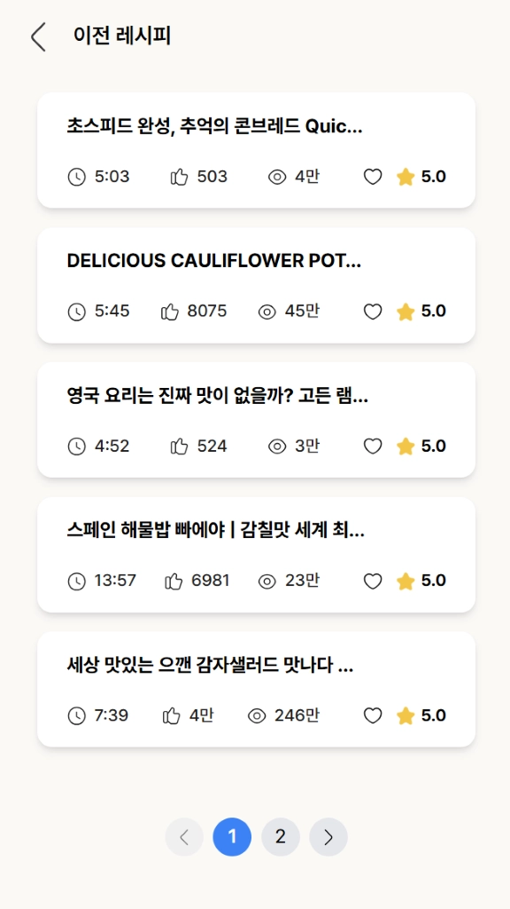

## 기술 스택

**Frontend** <br> 


**Backend** <br> 


**AI** <br> 


**DevOps** <br> 


**Tools** <br> 


<br>

## 서비스 아키텍처
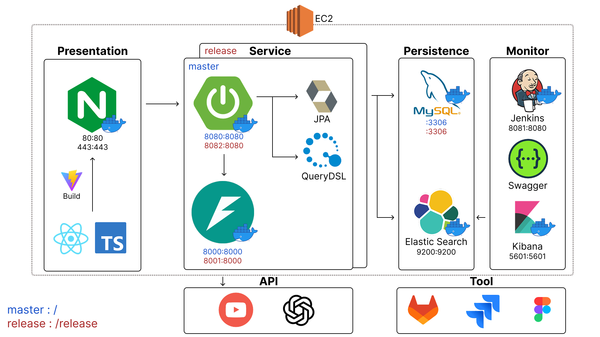

<br>

## ERD

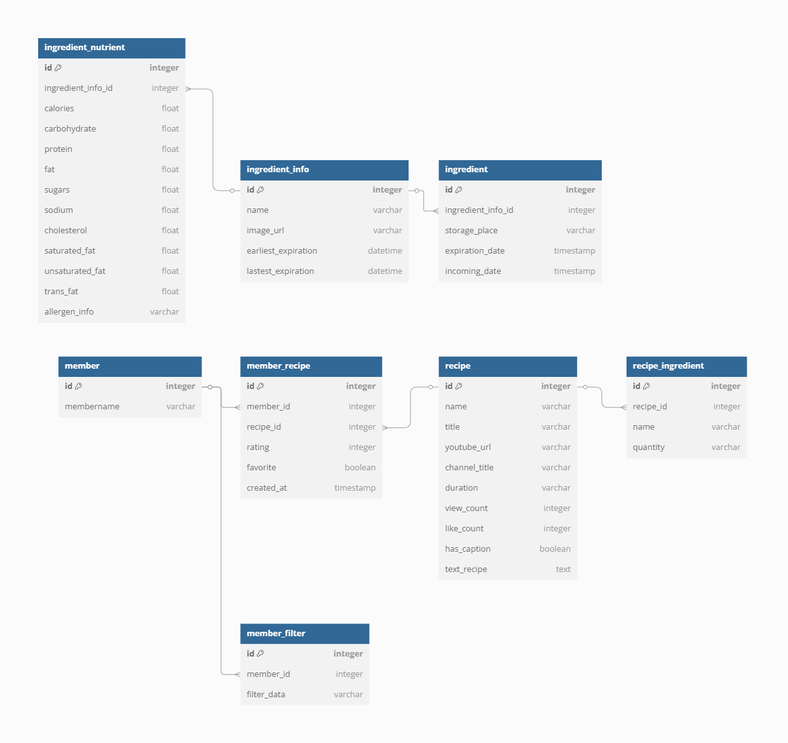

<br>

## 프로젝트 구조

### Frontend

```text
client
├── .yarn
├── public
└── src
    ├── apis
    ├── assets
    │   ├── fonts
    │   ├── icons
    │   ├── images
    │   └── sounds
    ├── components
    │   ├── common
    │   ├── Layout
    │   ├── profile
    │   └── recipeRating
    ├── data
    ├── hooks
    ├── mocks
    ├── pages
    ├── stores
    ├── styles
    ├── types
    ├── utils
    ├── App.tsx
    ├── index.css
    ├── main.tsx
    └── vite-env.d.ts
```

### BackEnd

```text
backend
└── src
    └── main
        ├── java
        │   └── com
        │       └── recipidia
        │           ├── aop
        │           ├── auth
        │           │   ├── config
        │           │   ├── controller
        │           │   ├── dto
        │           │   └── jwt
        │           ├── config
        │           ├── exception
        │           ├── filter
        │           │   ├── controller
        │           │   ├── converter
        │           │   ├── dto
        │           │   ├── entity
        │           │   ├── repository
        │           │   └── service
        │           ├── ingredient
        │           │   ├── controller
        │           │   ├── document
        │           │   ├── dto
        │           │   ├── entity
        │           │   ├── enums
        │           │   ├── exception
        │           │   ├── handler
        │           │   ├── repository
        │           │   │   └── querydsl
        │           │   ├── request
        │           │   ├── response
        │           │   ├── scheduler
        │           │   └── service
        │           ├── member
        │           │   ├── controller
        │           │   ├── dto
        │           │   ├── entity
        │           │   ├── exception
        │           │   ├── handler
        │           │   ├── repository
        │           │   ├── request
        │           │   ├── response
        │           │   └── service
        │           └── recipe
        │               ├── controller
        │               ├── converter
        │               ├── dto
        │               ├── entity
        │               ├── exception
        │               ├── handler
        │               ├── repository
        │               ├── request
        │               ├── response
        │               └── service
        └── resources
            ├── application.yml
            └── data
```

### AI

```text
ai
├── app
│   ├── api
│   │   └── f1
│   │       └── endpoints
│   ├── core
│   ├── models
│   ├── services
│   │   ├── LLM
│   │   └── external_api
│   └── utils
│       └── prompts
└── test
    └── utils
```

## 포팅매뉴얼

[포팅매뉴얼 바로가기](https://lab.ssafy.com/s12-s-project/S12P21S003/-/blob/release/exec/README.md?ref_type=heads)

## 팀 소개

| 이름           | 역할 및 구현 기능                                                                                    |
| -------------- | ---------------------------------------------------------------------------------------------------- |
| 🟧이하영(팀장) | **Frontend**<br>- 화면 UI/UX 설계 <br>- 레시피 화면 구현 및 API 연결<br>                             |
| 🟩이성준       | **Frontend**<br>- 화면 UI/UX 설계<br>- 재료 화면 구현 및 API 연결 <br>                               |
| 🟦민경훈       | **Backend**<br>- DB 설계<br>- 재료, 레시피 등 API 구현<br> <br>                                      |
| 🟥최효재       | **Infra**<br>- Docker, Docker-compose로 프로젝트 실행과 배포 환경 구축<br>- Jenkins로 CI/CD 구축<br> |
| 🟨노규헌       | **AI**<br>- 레시피 생성 로직 설계 및 구현 <br>- AI 성능평가 및 고도화 <br>                           |
| 🟪안태현       | **AI**<br>- 레시피 추출 로직 설계 및 구현 <br>- AI 성능평가 및 고도화 <br>                           |
